# 基础环境搭建
___
- [目录]
  - 一.[登录](#Login)
  - 二.[virtualenv](#virtualenv)
  - 三.[建立自己的容器](#Container)
  - 四.[远程桌面](#RemoteDesktop)
  - 五.[代码编辑与调试](#Code&Debug)

# Login
假设你已经申请到账号，账号名为:test，密码默认为:123，以ip地址为:192.168.7.183的服务器为例。

- linux/mac用户:
    ```
    ssh test@192.168.7.183
    ```
- windwos用户:
  
  windows用户可以安装[Cygwin](https://cygwin.com/setup-x86_64.exe)或者安装
  [Anaconda](https://repo.anaconda.com/archive/Anaconda3-2018.12-Windows-x86_64.exe)使用上ssh命令。如下图:
  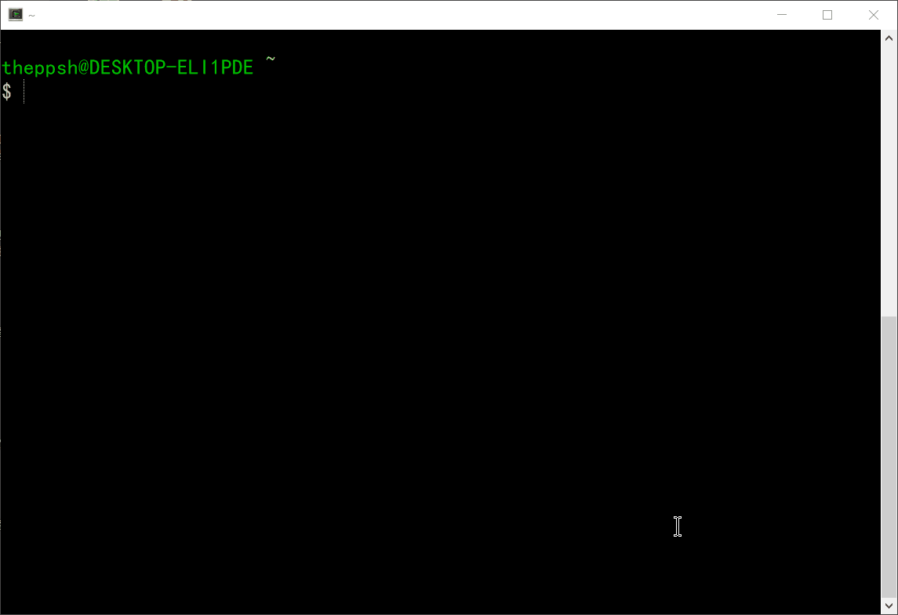

# virtualenv
如果不需要独立的系统环境，只用python，使用virtualenv命令足够应付大多数python库的安装，直接跳过Container部分内容也可正常使用。virtualenv比docker轻，而且也可以复用，不用什么端口转发，与客户端通信也方便。当然Anaconda环境可作为第三种选择。
## 2.1 创建virtualenv环境:
创建基于python3.6的环境
   ```
   virtualenv -p `which python3.6` ~/workspace/my_python3_env
   ```
   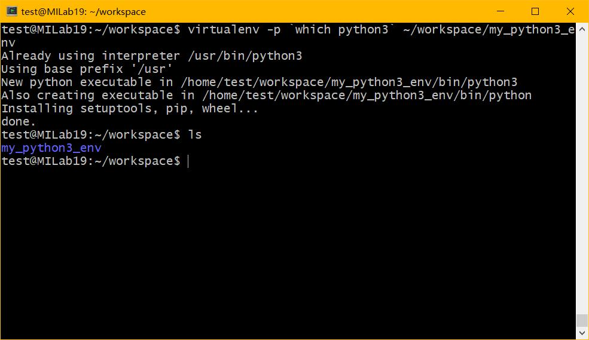
如果想要其他python版本改下名字即可，例如将python 3.6改为python3.4可以创建基于python3.4的环境。

## 2.2 激活环境
   ```
   source ~/workspace/my_python3_env/bin/activate
   ```
   激活环境后执行`python`即可进入virtualenv的python3.6。

## 2.3 更改pip源
  改为清华的源，也可以用163、阿里的。
  
   ```
   echo -e '[global]\nindex-url = https://pypi.tuna.tsinghua.edu.cn/simple\n[install]\ntrusted-host=mirrors.aliyun.com' > ~/.pip/pip.conf
   ```
   接下来就可以正常的使用`pip`命令安装所需要的库，例如`pip3 install torch torchcv`安装PyTorch。安装的库会安装在创建的virtualenv目录下，不会影响系统Python环境，也不需要root权限。重新登录到SSH后只需要再执行上一步的激活环境命令即可。

## 2.4 退出环境
   暂时不需要virtualenv环境下的Python可以用以下命令退出
   ```
   deactivate
   ```


# Container
现在你应该已经进入了服务器的终端界面。接下来会介绍如何利用docker命令创建自己的容器(container)。(如果virtualenv已经满足使用，可以不用docker)

## 3.1 docker简单介绍
使用docker的目的是为了给同一台机器创建多个互不干扰的环境，可以简单当作虚拟机使用。所有想要安装、使用的软件，请在自己创建的容器中安装、使用，请不要再在docker外执行，以免干扰到其他人。

## 3.2 创建一个容器
为了便于理解，你可以把创建一个容器看作创建了一个虚拟机。创建的步骤主要为：
### 3.2.1 获取最基础的镜像包
这里以镜像名为ubuntu:19.04的镜像为例:
```
sudo docker pull ubuntu:19.04
```
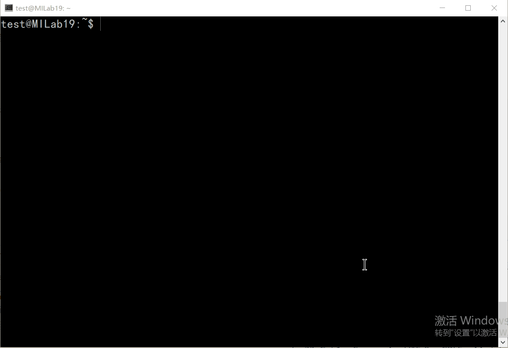
### 3.2.2 创建一个新的容器
- 创建容器并且将显卡设备挂入到新建的容器中:
    ```
    sudo docker run -i -t  -p 外部端口:内部端口 --shm-size 4gb --name="你的名字" --device /dev/nvidiactl --device /dev/nvidia-uvm --device /dev/nvidia0 --device /dev/nvidia1 -v /home/你的目录:/root/workspace 镜像名 /bin/bash
    ```
    外部端口指的是容器外的宿主机端口，内部端口即容器("虚拟机")的端口。“你的名字”指的是将要创建的容器的名字，请替换为自定义的名字，注意不要以已有的容器名冲突。“你的目录”请替换为自己的用户名，这里为test。镜像名这里为ubuntu:19.04
    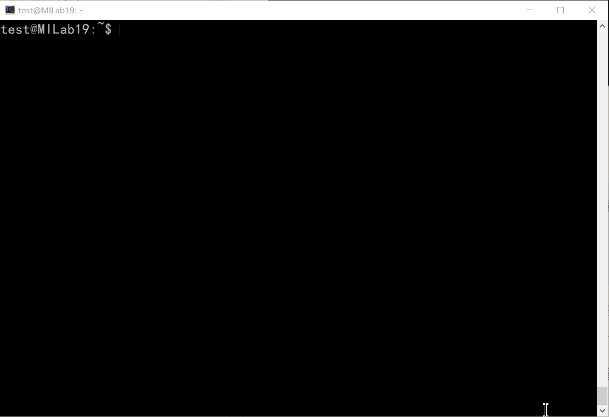
    通过宿主机的9200端口与容器的5901端口进行通信，这里设为5901是为了方便后续的vnc配置使用。请留意，宿主机的端口号(即外部端口)也不要与已创建的容器相冲突，可以使用`sudo docker ps -a`命令查看已经创建的容器的名字以及其映射的端口号:
    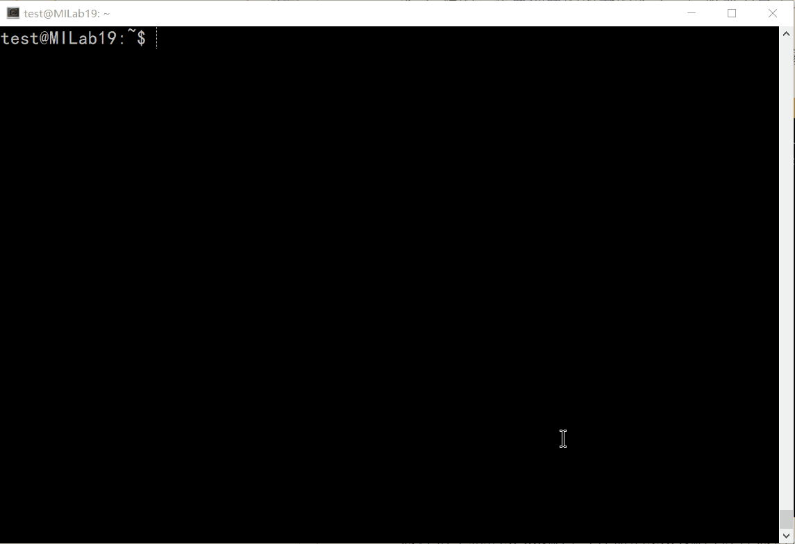
    可以看到名为`zf_container`的容器，映射了1002的外部端口到8000的容器内部端口。当然，管理员预留了已经配好的镜像，如果怕麻烦可以直接拿管理员的镜像来用，可以跳去接下来的所有步骤。可以使用`sudo docker images`获取本机上安装的镜像:
    
Note:
  - 关闭容器:
    ```
    sudo docker stop 容器名字
    ```
  - 重启容器:
    ```
    sudo docker restart 容器名字
    ```
    想要重启自己的容器，请用上面的命令，请`不要`在容器里执行reboot命令，会导致宿主机也一起重启。。。
  - 进入容器内部的命令行:
    ```
    sudo docker exec -it 容器名字 /bin/bash
    ```
  - 移除一个容器:
    ```
    sudo docker rm 容器名字 
    ```
    移除时看准了删除，不要讲其他人的容器给删了...
  - 移除一个镜像:
    ```
    sudo docker rmi 镜像名字
    ```
    注意镜像(image)与容器(container)不是一个东西， 前面我们用docker pull的ubuntu:19.04，这个东西是镜像，用docker run创建的名为test的，是容器名。如果有基于某镜像的容器，必须先将该容器删除，否则该镜像是无法被删除的。

### 3.2.3 安装nvidia显卡驱动
对于使用官方纯净镜像的玩家，刚进入容器的时候是几乎什么都没有的，所以大部分东西都要手动安装。这里建议先安装显卡驱动，注意容器的显卡驱动要与宿主机的驱动一致，否则没法使用。可以在宿主机(容器外部)使用```nvidia-smi | grep Driver```命令查看驱动版本:
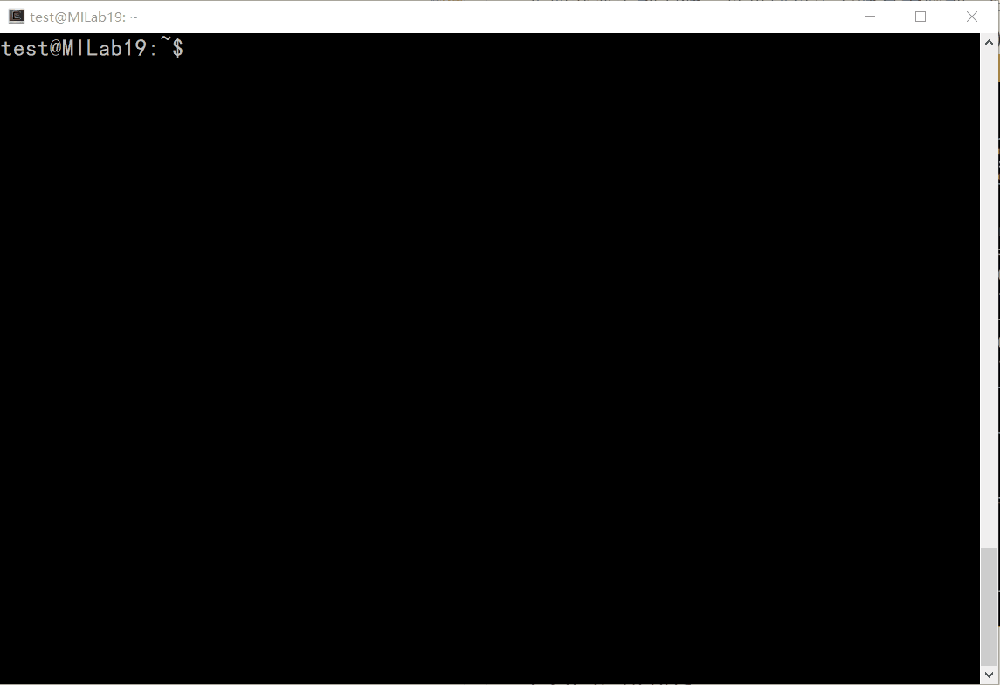
可以看到此时宿主机的驱动版本为384.111。
n卡官方的linux驱动地址[下载](https://www.nvidia.com/object/unix.html)。
这里我已经将驱动(包括对应的cuda安装包)放到了宿主机的`/NVIDIA`目录下，请先将其拷贝到自己对应的`workspace`工作目录下。

- 安装vim:
  ```
  apt update && apt install vim -y
  ```

- 更换源
  ```
  vim /etc/apt/sources.list
  ```
  清除原有内容，输入以下内容:
  ```
  deb http://mirrors.aliyun.com/ubuntu/ disco main restricted universe multiverse
  deb http://mirrors.aliyun.com/ubuntu/ disco-security main restricted universe multiverse
  deb http://mirrors.aliyun.com/ubuntu/ disco-updates main restricted universe multiverse
  deb http://mirrors.aliyun.com/ubuntu/ disco-proposed main restricted universe multiverse
  deb http://mirrors.aliyun.com/ubuntu/ disco-backports main restricted universe multiverse
  deb-src http://mirrors.aliyun.com/ubuntu/ disco main restricted universe multiverse
  deb-src http://mirrors.aliyun.com/ubuntu/ disco-security main restricted universe multiverse
  deb-src http://mirrors.aliyun.com/ubuntu/ disco-updates main restricted universe multiverse
  deb-src http://mirrors.aliyun.com/ubuntu/ disco-proposed main restricted universe multiverse
  deb-src http://mirrors.aliyun.com/ubuntu/ disco-backports main restricted universe multiverse
  ```
  这里用的是ubuntu19.04的源，其他版本的源可以自己从网上找。vim在命令模式按`i`可进行插入编辑。复制完后按`Esc`键切换为命令模式后输入`:wq!`保存并退出。

- 安装一些misc 
  ```
  apt update && apt install perl gcc-5 g++-5 cmake make vim kmod git -y
  ```
- 将gcc降级
  ```
  cd /usr/bin && rm gcc g++ cc c++&& ln -s gcc-5 gcc && ln -s g++-5 g++ && ln -s gcc cc && ln -s g++ c++ 
  ```

- 安装NVIDIA驱动:
  ```
  ./NVIDIA-Linux-x86_64-384.111.run -s -no-kernel-module
  ``` 
  安装完后可以执行`nvidia-smi`即为成功:
  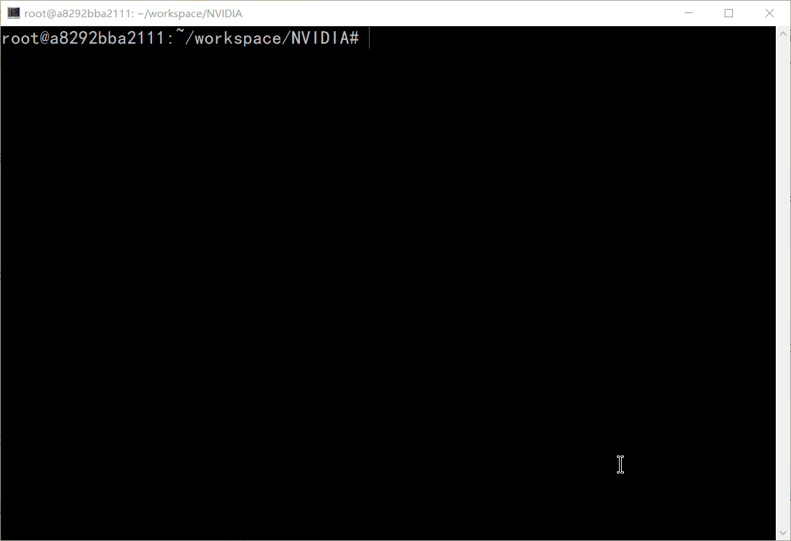
  如果想要卸载驱动可以执行:
  ```
  ./NVIDIA-Linux-x86_64-384.111.run --uninstall
  ```
  注意如果正在使用`x11`应用，是无法安装上驱动的，应先把`lightdm`或者`gdm`服务停掉:
  ```
  service lightdm stop
  ```
  或者:
  ```
  service gdm stop
  ```
### 3.2.4 安装cuda与cudnn
[cuda](https://developer.nvidia.com/cuda-downloads?target_os=Linux&target_arch=x86_64&target_distro=Ubuntu&target_version=1804&target_type=runfilelocal)与[cudnn](https://developer.nvidia.com/rdp/cudnn-download)均可从nvidia的官网进行下载，cudnn需要注册并且同意相关条款才可使用。理论上不用cudnn也行，用了cudnn某些运算会加快。
- 执行安装包
  ```
  ./cuda_9.0.176_384.81_linux.run
  ```
  按提示操作即可，注意`不要`选择安装驱动，因为驱动已经在之前安装了:
  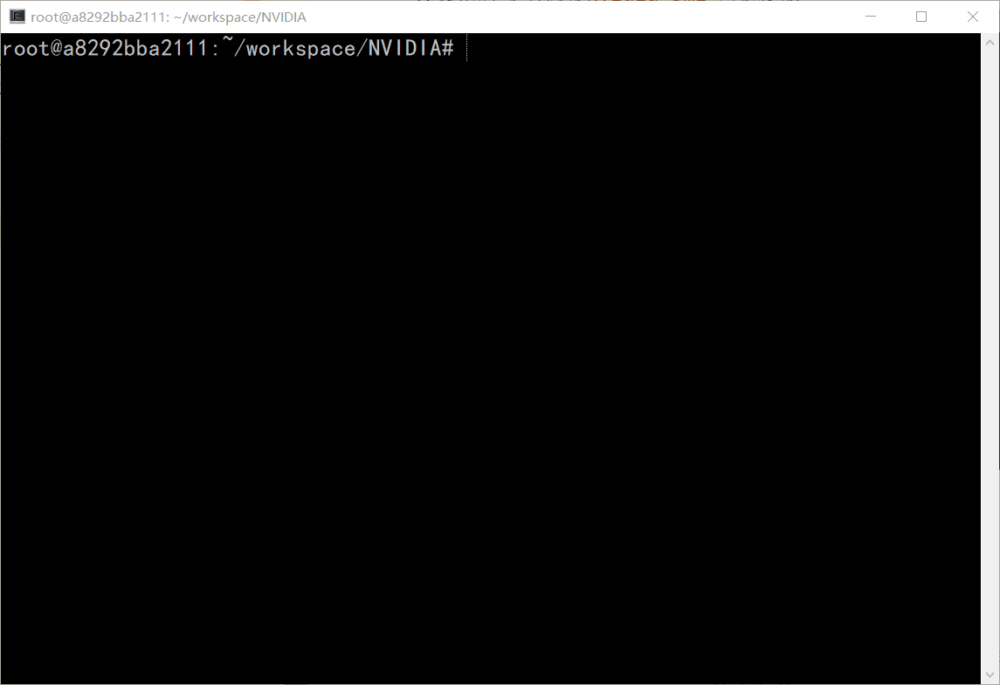

- 安装cudnn
  ```
  cd cuda && cp include/* /usr/local/cuda/include/ && cp lib64/* /usr/local/cuda/lib64/*
  ```
  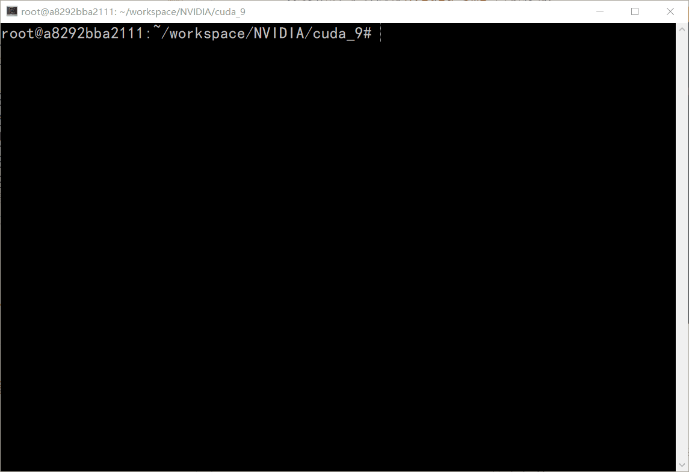

- 添加bash路径:
  ```
  vim ~/.bashrc
  ```
  在末尾添加：
  ```
  # cuda path
  export LD_LIBRARY_PATH=/usr/local/cuda/lib64/:$LD_LIBRARY_PATH
  export PATH=/usr/local/cuda/bin:$PATH
  ```
  保存并退出，使用
  ```
  source ~/.bashrc
  ```
  应用到当前环境:
  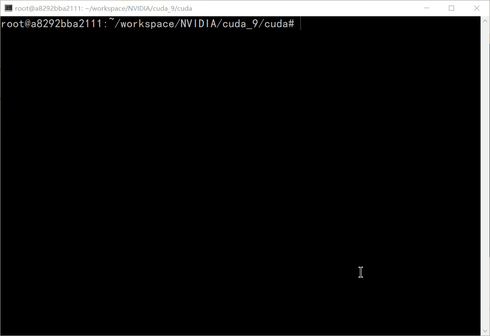

 
# RemoteDesktop
接下来将在容器中使用vnc进行远程桌面的搭建。

4.1 安装xfce4桌面:
   ```
   apt install xfce4* -y
   ```
   中间会让你选择地理位置、键盘等，看着选就行。选择default display manager的时候，选择lightdm。过程太长就不截图了。

4.2 安装vncserver:
   ```
   apt install vnc4server -y
   ```
4.3 运行vncserver:
   ```
   vncserver -geometry 1920x1080 :1
   ```
   会要求创建vnc的密码，供登录使用

4.4 关闭vncserver:
   ```
   vncserver -kill :1
   ```

4.5 修改`~/.vnc/xstartup`:
   
   ```
   vim ~/.vnc/xstartup
   ```

   输入以下内容:
   ```
   #!/bin/sh

   # Uncomment the following two lines for normal desktop:
   # unset SESSION_MANAGER
   # exec /etc/X11/xinit/xinitrc

   [ -x /etc/vnc/xstartup ] && exec /etc/vnc/xstartup
   [ -r $HOME/.Xresources ] && xrdb $HOME/.Xresources
   xsetroot -solid grey
   vncconfig -iconic &
   x-terminal-emulator -geometry 80x24+10+10 -ls -title "$VNCDESKTOP Desktop" &
   x-window-manager &
   startxfce4 &
   ``` 
   然后重新启动`vncserver`

4.6 下载vnc客户端(vnc viewer):
- [Linux](https://www.realvnc.com/en/connect/download/viewer/linux/)版本的客户端和[Windows](https://www.realvnc.com/en/connect/download/viewer/windows/)版的客户端可以分别在官网下载。
- 打开VNCViewer, 输入ip+外部端口号，这里为:`192.168.7.183:9200`，连接上后输入之前创建的vncserver密码，即可进入xfce4桌面:
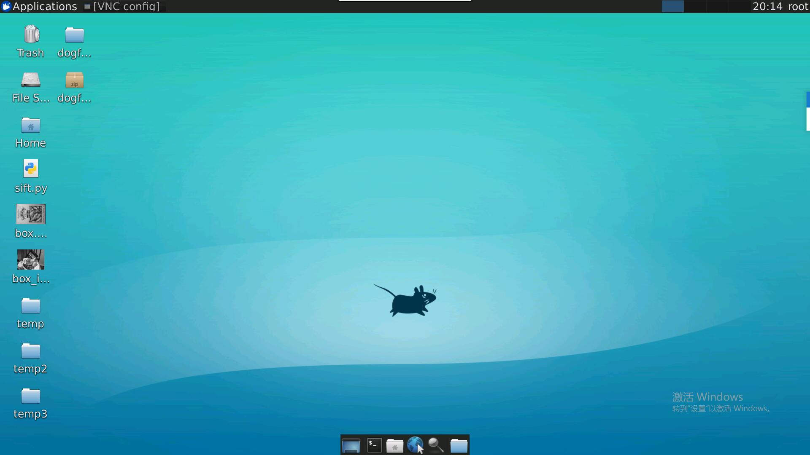
其它的桌面如gnome-destop， deepin-desktop等，也是可以进行配置使用的，感兴趣的可以自己尝试。

# Code&Debug
在服务器上进行代码编辑调试工作，包括并不限于以下几种选择
- 1. SSH+VIM: 
  
      推荐指数：★★☆☆☆\
      熟练了就会很快乐。对新手不友好。。。搞CV的可能就会很难受。

- 2. VNC远程桌面环境：

      推荐指数：★★★★☆\
      图形界面基本上满足所有的需求，可以直接执行各种IDE，例如CLion，VSCode，PyCharm，IDEA，Eclipse等，方便开发调试。有时候会很卡，且占用更多的资源。。。

- 3. Jupyter Notebook：

      推荐指数：★★★★☆\
      所见即所得，还能顺便写写公式。遇到交互式界面就傻了，C/C++支持即麻烦又不好用。。。使用参考这里[这里](../lib/lib.md#jupyter)

- 4. VSCode:
  
      推荐指数：★★★☆☆\
      最新的Remote插件支持从本地直接连接到服务器上的VSCode。由于SSH会话不是唯一的，导致重连接后找不到正在炼丹的进程。。。

- 5. CodeServer:
  
      推荐指数：★★☆☆☆\
      可在浏览器中使用VSCode。有一些显示上的bug，字体也不舒服，插件源是CodeServer自己维护的，所以下载非常的慢。。。
  
- 6. 自己买个工作站:
  
      推荐指数：★★★★★\
      可以随便折腾，会更加快乐。实力与地位的象征。
